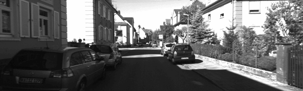
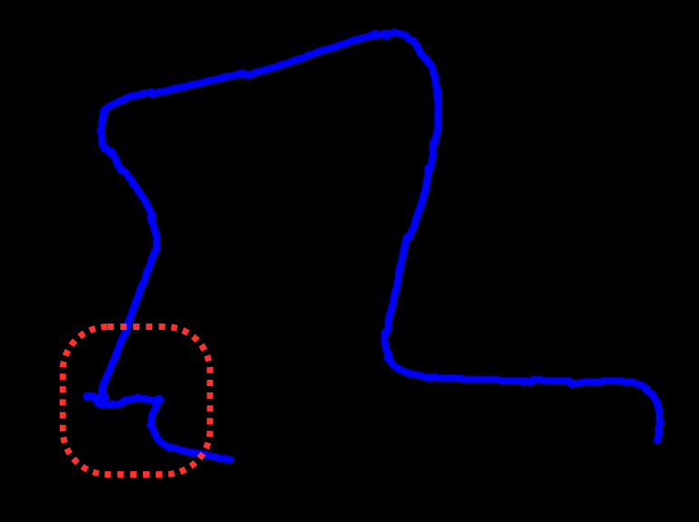
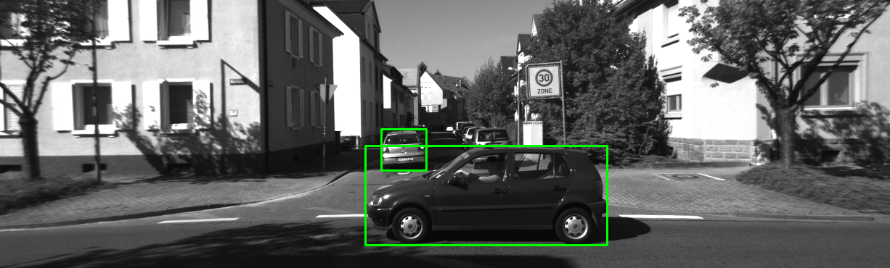
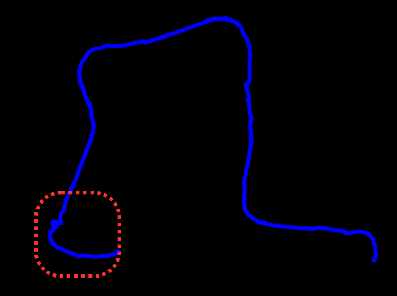

# Object Detection Enhanced Visual Odometry

## Overview

This project integrates object detection capabilities into visual odometry systems to enhance the accuracy and robustness of pose estimation in environments with dynamic objects. By identifying and tracking objects within a scene, the system can mitigate the adverse effects of moving entities on visual odometry calculations. An example is discussed here.

Consider the following GIF generated from KITTI dataset sequence 7, where the car comes to an intersection, waits for other cars to pass and turns left.

<p align="center">
 
</p>
<p align="center"><em>KITTI dataset Sequence 7</em></p>

In feature based odometry, since the cars in the field of view of the ego vehicle are moving, if enough features are detected on the moving cars, the calculaed trajectory of the ego vehicle would change and have unwanted poses even though the ego vehicle is stationary. This is because there is an implicit assumption that all the objects in the scene are stationary. If there are dynamic objects in the scene, it will create errors in the pose estimation. This can be observed in the following image:

<p align="center">
 
</p>
<p align="center"><em>Estimated Trajectory before Object Detection Enhancement</em></p>

To avoid this, YOLO is used to identify dynamic objects in the scene (eg. cars, humans, etc.). An example of detected objects can be seen in the following image.

<p align="center">
 
</p>
<p align="center"><em>Detection of Dynamic Objects</em></p>


Once these have been identified, all the keypoints on these objects are removed, thus providing an improvement in the entire trajectory. This can be observed in the following image as we obtain a much better estimate of the trajectory in the highlighted part and also an overall improvement in the estimated trajectory.

<p align="center">
 
</p>
<p align="center"><em>Estimated Trajectory after Object Detection Enhancement</em></p>

## Installation

1. **Clone the repository**:

   ```bash
   git clone https://github.com/Dhrumil-Kotadia/Object_Detection_Enhanced_Visual_Odometry.git
   cd Object_Detection_Enhanced_Visual_Odometry
   ```

2. **Install dependencies**:

   Ensure you have Python installed. Then, install the required Python packages:

   ```bash
   pip install -r requirements.txt
   ```

## Usage

1. **Prepare your dataset**:

   Place your input images in the `data/` directory. Ensure that the images are in correct format. Check and update the path if necessary in Wrapper.py

2. **Run the system**:

   Execute the main script to perform object detection enhanced visual odometry:

   ```bash
   python3 Wrapper.py
   ```

3. **View results**:

   Run the Visualize.ipynb file to visualize the generated trajectory in matplotlib. Ensure the filenames and filepaths are correct. Update if necessary.

## Contributing

Contributions are welcome! Please fork the repository and create a pull request with your changes. Ensure that your code adheres to the project's coding standards and includes appropriate tests.

## License

This project is licensed under the MIT License. See the [LICENSE](LICENSE) file for details.


For any questions or issues, please open an [issue](https://github.com/Dhrumil-Kotadia/Object_Detection_Enhanced_Visual_Odometry/issues) in the repository. 